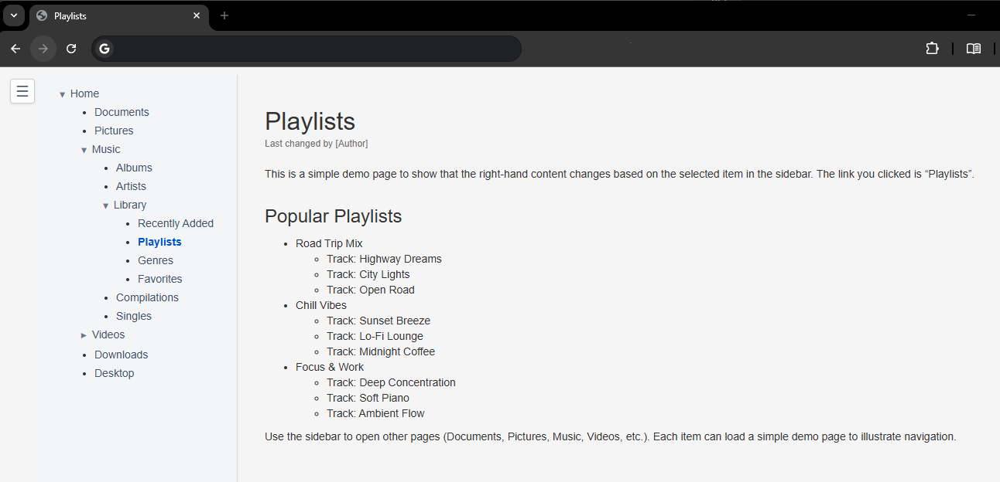

# ConfluenceBridge
This toolbox exports content from a Confluence instance (Cloud or Data Center) into a static, navigable HTML archive and converts it into professional, hierarchical PDF documents.



**Key Features:**
- **Visual Fidelity:** Fetches rendered HTML (`export_view`) to preserve macros, layouts, and formatting.
- **Navigation:** Injects a fully functional, static navigation sidebar into every HTML page.
- **Offline Browsing:** Localizes images and links, and downloads **all** attachments (PDFs, Office docs, etc.) for complete offline access.
- **Sort Order:** Recursively scans the tree to ensure the **manual sort order** from Confluence is preserved.
- **Metadata Injection:** Automatically adds Page Title, Author, and Modification Date to the top of every page.
- **Versioning:** Creates timestamped output folders (e.g., `2025-11-21 1400 Space IT`) for clean history management.
- **Format Agnostic:** Built to bridge the gap between Confluence Storage Format and modern documentation standards like Asciidoc and Markdown.
- **Professional PDF:** Merges the content into a single PDF with TOC, Bookmarks, and mixed Portrait/Landscape orientation.
- **🆕 ETL-Pipeline Architecture:** Strict separation of Download (Extract), Processing (Transform), and Output (Load) for maximum flexibility.
- **🆕 Delta-Sync:** Only changed pages are downloaded – saves time and network traffic.
- **🆕 Self-Contained Workspaces:** All parameters are saved in the workspace. Future syncs only require the path.
- **🆕 Offline Rebuild:** HTML files can be regenerated from raw data at any time (e.g., after CSS changes).
## Toolbox Overview (Key Files)
- **`confluenceDumpToHTML.py`**: The main downloader. Connects to Confluence, scrapes content, and creates the folder structure.
- **`htmlToDoc.py`**: The publisher. Converts the downloaded HTML folder into a single PDF or a Master-HTML file for LLMs.
- **`confluence_products.ini`**: Configuration file for API URLs (Cloud vs. Data Center).
- **`styles/`**: Contains CSS files. `site.css` (if present) is applied automatically. `pdf_settings.css` configures the PDF layout (A4/Letter, Margins).
## Quick Start Guide
Follow these steps to create your first PDF export of a single page tree.

### 1\. Setup
Install requirements, setup the headless browser (Playwright), and set your credentials.
```bash
pip install -r requirements.txt

# Install Playwright browsers (required for rendering complex Confluence macros)
playwright install chromium

# Windows Users: Install GTK3 Runtime for PDF generation!
```

**Linux/Mac:**
```bash
export CONFLUENCE_TOKEN="YourPersonalAccessToken"
```

**Windows (Powershell):**
```powershell
$env:CONFLUENCE_TOKEN="YourPersonalAccessToken"
```

### 2\. The Dump (Download)
Run the dumper for a specific page tree. This will create a new folder in `output/`.

```bash
# Example for Data Center
python3 confluenceDumpToHTML.py --use-etl --base-url "https://confluence.corp.com" --profile dc --context-path "/wiki" -o "./output" tree -p "123456"
```

**⚠️ Important:** The `--use-etl` flag activates the new ETL-Pipeline architecture (Extract-Transform-Load). This is **required** for Delta-Sync and all new features.

### 3\. The Publication (PDF)
Look into the `output` folder. You will see a new folder like `2025-01-27 0900 My Page Title`. Use this path for the PDF generator.

```bash
python3 htmlToDoc.py --site-dir "./output/2025-01-27 0900 My Page Title" --pdf
```

_Result: You now have a `... .pdf` inside that folder._

---

## 🆕 Self-Contained Workspaces & Delta-Sync

### Concept: Zero-Config Sync

With the new ETL-Pipeline, all download parameters are automatically saved in the workspace (`config.json`). For future syncs, you **don't need to specify any parameters** – the workspace is fully self-describing.

**Benefits:**
- ✅ **Error-Resistant:** No more accidental parameter conflicts.
- ✅ **Fast:** Delta-Sync only downloads changed pages.
- ✅ **Template-Ready:** Workspaces can be copied and re-initialized.

### Workflow 1: Initial Download (First Time)

On the first download, all parameters are saved in `config.json`:

```bash
# Example: Full Space
python3 confluenceDumpToHTML.py --use-etl \
  --base-url "https://confluence.corp.com" \
  --profile dc \
  --context-path "/wiki" \
  -o "./output" \
  space --space-key IT
```

**What happens:**
1. Download all pages in Space "IT"
2. Save raw data to `raw-data/`
3. Generate final HTML files in `pages/`
4. **Automatic creation of `config.json`** with all parameters

**Output:**
```
[INFO] New workspace. Starting initial download...
Phase 1: Recursive Inventory Scan...
Inventory complete. Found 142 pages.
Phase 2: Downloading & Processing 142 pages with 8 threads...
Downloading: 100%|████████████████████| 142/142 [02:15<00:00, 1.05page/s]

[INFO] Saving workspace configuration...
[INFO] Configuration saved to ./output/2025-03-16 1430 Space IT/config.json

💡 FUTURE SYNCS (Zero-Config):
  python confluenceDumpToHTML.py --use-etl -o "./output/2025-03-16 1430 Space IT"

💡 REBUILD WORKSPACE:
  python confluenceDumpToHTML.py --use-etl --init -o "./output/2025-03-16 1430 Space IT"

✅ Download complete. Output in: ./output/2025-03-16 1430 Space IT
```

### Workflow 2: Delta-Sync (Update)

For future runs, **only the workspace path** is needed:

```bash
# Zero-Config Sync – all parameters loaded from config.json
python3 confluenceDumpToHTML.py --use-etl -o "./output/2025-03-16 1430 Space IT"
```

**What happens:**
1. Load parameters from `config.json`
2. Compare Confluence version numbers with `manifest.json`
3. Download **only** changed pages
4. Update final HTML files

**Output:**
```
[INFO] Workspace detected. Loading configuration from ./output/2025-03-16 1430 Space IT/config.json...
[INFO] Configuration loaded successfully. Delta-Sync active.
Phase 1: Recursive Inventory Scan...
Inventory complete. Found 142 pages.
Phase 2: Downloading & Processing 142 pages with 8 threads...
  [SKIP] Page 123456 (Version 42 unchanged)
  [SKIP] Page 789012 (Version 15 unchanged)
  [DOWNLOAD] Page 555555 (Version 18 → 19)
Downloading: 100%|████████████████████| 1/142 [00:02<00:00, 0.5page/s]

✅ Download complete. Output in: ./output/2025-03-16 1430 Space IT
```

**⏱️ Time Savings:** For a space with 142 pages and only 1 change: **From 2:15 min to 2 seconds!**

### Workflow 3: Using Workspace as Template

You can copy an existing workspace and re-initialize it with new parameters:

```bash
# 1. Copy workspace
cp -r "./output/2025-03-16 1430 Space IT" "./output/2025-03-16 1430 Space IT (Copy)"

# 2. Rebuild with --init flag (deletes raw-data/, pages/, attachments/)
python3 confluenceDumpToHTML.py --use-etl --init \
  -o "./output/2025-03-16 1430 Space IT (Copy)" \
  tree --pageid 999999
```

**What happens:**
1. Delete `raw-data/`, `pages/`, `attachments/`
2. Keep `config.json` and `styles/`
3. Rebuild with new parameters (here: different page tree)

**⚠️ Important:** The `--init` flag is **destructive**. Only use it when you really want to rebuild the workspace.

### Workflow 4: Offline HTML Rebuild

After changing CSS files or editing the sidebar structure, you can regenerate all HTML files without re-downloading from Confluence:

```bash
# Rebuild HTML from existing raw-data/
python3 confluenceDumpToHTML.py --use-etl --build-only \
  -o "./output/2025-03-16 1430 Space IT"
```

**What happens:**
1. Load configuration from `config.json`
2. Load metadata from `manifest.json`
3. Read raw HTML from `raw-data/`
4. Regenerate all HTML files in `pages/`
5. Update `index.html` and `sidebar.html`

**⚡ Speed:** For a workspace with 142 pages: **~5 seconds** (no network calls).

**Use Cases:**
- ✅ CSS file changes (e.g., new `site.css`)
- ✅ Sidebar structure edits (via `patch_sidebar.py`)
- ✅ Testing HTML processing changes
- ✅ Recovering from corrupted `pages/` directory

### Workflow 5: Resolving Parameter Conflicts

If you accidentally specify different parameters than during the initial download, you'll get a **Fail-Fast error**:

```bash
# Error: Different space key than initial download
python3 confluenceDumpToHTML.py --use-etl -o "./output/2025-03-16 1430 Space IT" space --space-key HR
```

**Output:**
```
╔════════════════════════════════════════════════════════════════╗
║ ERROR: Configuration conflict detected                        ║
╚════════════════════════════════════════════════════════════════╝

📋 PROBLEM:
  Parameter 'space_key' differs from saved configuration.
  Expected: 'IT', Received: 'HR'

🔍 CAUSE:
  Delta-Sync requires identical parameters as the initial download.
  Divergent parameters would lead to inconsistent data.

✅ SOLUTION OPTIONS:
  1. For Delta-Sync: Use only the workspace path without additional parameters:
     python confluenceDumpToHTML.py --use-etl -o "./output/2025-03-16 1430 Space IT"

  2. For rebuild with new parameters: Use --init flag:
     python confluenceDumpToHTML.py --use-etl --init -o "./output/2025-03-16 1430 Space IT" space --space-key HR

  3. For completely new export: Create new workspace:
     python confluenceDumpToHTML.py --use-etl -o "./output" space --space-key HR

💡 TIP: The saved configuration can be found at:
     ./output/2025-03-16 1430 Space IT/config.json
```

### What is saved in `config.json`?

**Saved Parameters:**
- Download mode (`command`: space, tree, single, label, all-spaces)
- Confluence URL (`base_url`, `profile`, `context_path`)
- Scope parameters (`space_key`, `pageid`, `label`)
- Filter parameters (`exclude_page_id`, `exclude_label`)
- Feature flags (`debug_storage`, `debug_views`, `no_metadata_json`)

**NOT saved parameters:**
- ❌ Credentials (`CONFLUENCE_USER`, `CONFLUENCE_TOKEN`) – for security reasons
- ❌ Transient flags (`--no-vpn-reminder`) – only for one-time use
- ❌ Performance parameters (`--threads`) – can be overridden on each sync

**Example `config.json`:**
```json
{
  "version": "1.0",
  "created": "2025-03-16T14:30:00Z",
  "command": "space",
  "base_url": "https://confluence.corp.com",
  "profile": "dc",
  "context_path": "/wiki",
  "space_key": "IT",
  "exclude_page_id": ["555555"],
  "threads": 8,
  "config_hash": "a3f5e8d9c2b1..."
}
```

### Workspace Directory Structure

```
output/2025-03-16 1430 Space IT/
├── config.json              # 🆕 Workspace Configuration (Self-Contained)
├── raw-data/                # 🆕 Staging Area (Raw data from Confluence)
│   ├── manifest.json        # 🆕 State tracking for Delta-Sync
│   ├── 123456/              # One subdirectory per page
│   │   ├── meta.json        # Metadata (Version, Title, Ancestors, Labels)
│   │   ├── content.html     # Raw HTML body (export_view)
│   │   ├── storage.xml      # Storage Format (for Anchor-Repair)
│   │   └── attachments/     # Page-specific attachments
│   │       ├── image.png
│   │       └── document.pdf
│   └── 789012/
│       ├── meta.json
│       ├── content.html
│       └── attachments/
├── pages/                   # Final HTML files (can be regenerated via --build-only)
│   ├── 123456.html
│   └── 789012.html
├── attachments/             # Copy of all attachments (for final HTML)
│   ├── image.png
│   └── document.pdf
├── styles/                  # CSS files
│   └── site.css
├── sidebar.html             # Generated navigation
└── index.html               # Global index
```

**Important:** The `raw-data/` structure is the **Source of Truth**. The `pages/` files can be regenerated from `raw-data/` at any time using `--build-only` (e.g., after CSS changes or sidebar edits).

---
## Platform Support & Authentication
This script supports both **Confluence Cloud** and **Confluence Data Center**.
> **⚠️ Note on Cloud Verification:** The Cloud support has been ported to the new architecture but was primarily developed and tested against a **Confluence Data Center** environment.
### Configuration
Define API paths in `confluence_products.ini`. Authentication is handled via Environment Variables:
- **Cloud:** `CONFLUENCE_USER` (Email) and `CONFLUENCE_TOKEN` (API Token).
- **Data Center:** `CONFLUENCE_TOKEN` (Personal Access Token).
**⚠️ Troubleshooting Note for Data Center:** If authentication fails, ensure you are connected to the **VPN** and that your admin allows Personal Access Tokens (PAT).
## Detailed Usage: Stage 1 (HTML Export)
Downloads pages, builds the index, and creates a clean HTML base.

```bash
python3 confluenceDumpToHTML.py [OPTIONS] <COMMAND> [ARGS]
```

### Commands
- **`space`**: Dumps an entire space. (`-sp SPACEKEY`)
- **`tree`**: Dumps a specific page and its descendants. (`-p PAGEID`)
- **`single`**: Dumps a single page. (`-p PAGEID`)
- **`label`**: "Forest Mode". Dumps all pages with a specific label as root trees. (`-l LABEL`)
    - Use `--exclude-label` to prune specific subtrees (e.g. 'archived').
- **`all-spaces`**: Dumps all visible spaces.

### Common Options
- `-o`, `--outdir`: Base output directory (workspace path).
- `-t`, `--threads`: Number of download threads (e.g., `-t 8`).
- `--css-file`: Path to custom CSS (applied after standard styles).
- **🆕 `--use-etl`**: Activates the new ETL-Pipeline (Extract-Transform-Load). **Required for Delta-Sync.**
- **🆕 `--init`**: Resets the workspace (deletes `raw-data/`, `pages/`, `attachments/`). Useful for template usage.
- **🆕 `--build-only`**: Regenerates HTML files from existing `raw-data/` without downloading. Useful after CSS changes or sidebar edits.
- **🆕 `--skip-mhtml`**: Skips the automatic Playwright browser download for complex pages (falls back to basic API HTML).

### Examples

**Full Space (Initial):**
```bash
python3 confluenceDumpToHTML.py --use-etl \
  --base-url "https://confluence.corp.com" \
  --profile dc \
  --context-path "/wiki" \
  -o "./output" \
  space --space-key IT
```

**Full Space (Delta-Sync):**
```bash
python3 confluenceDumpToHTML.py --use-etl -o "./output/2025-03-16 1430 Space IT"
```

**Page-Tree (Initial):**
```bash
python3 confluenceDumpToHTML.py --use-etl \
  --base-url "https://confluence.corp.com" \
  --profile dc \
  --context-path "/wiki" \
  -o "./output" \
  tree --pageid 123456
```

**Label-based with exclusion:**
```bash
python3 confluenceDumpToHTML.py --use-etl \
  --base-url "https://confluence.corp.com" \
  --profile dc \
  --context-path "/wiki" \
  -o "./output" \
  label --label "important" --exclude-label "archived"
```

**Rebuild workspace:**
```bash
python3 confluenceDumpToHTML.py --use-etl --init \
  -o "./output/2025-03-16 1430 Space IT" \
  tree --pageid 999999
```

**Offline HTML rebuild (e.g., after CSS changes):**
```bash
python3 confluenceDumpToHTML.py --use-etl --build-only \
  -o "./output/2025-03-16 1430 Space IT"
```
### Handling Complex Macros (MHTML Fallback)
**The Problem:** Some Confluence pages (e.g., complex Table Filters or Draw.io diagrams) fail to render completely via the standard REST API due to heavy client-side JavaScript.

**The Automated Solution (Playwright):** 
By default, the script analyzes the downloaded raw data. If it detects complex macros, it automatically launches a headless Chromium browser via Playwright, authenticates, and downloads a fully rendered `.mhtml` snapshot into `raw-data/[PageID]/content.mhtml`. The script automatically extracts the HTML and attachments from this archive.

**The Manual Solution (Fallback):**
If the automated Playwright download fails (e.g., due to strict company SSO/MFA that blocks headless browsers), you can provide the MHTML files manually:
1. Open the problematic Confluence page in Chrome/Edge.
2. Save the page as **"Webpage, Single File (*.mhtml)"**.
3. Rename it to exactly `[PageID].mhtml` (e.g., `123456.mhtml`).
4. Place it in the `full-pages/` directory inside your workspace.
5. Run the script normally or with `--build-only`. The script will prioritize your manual MHTML file over the API data.
## Detailed Usage: Stage 2 (Architecture Sandbox)
Allows re-organizing the structure (Index) locally without touching Confluence.
1. **Generate Editor:**
    ```
    python3 create_editor.py --site-dir "./output/2025-01-01 Space IT"
    ```
2. **Edit:** Open `editor_sidebar.html`. Use Drag & Drop to move pages/folders.
3. **Save:** Click "Copy Markdown", paste into `sidebar_edit.md`.
4. **Apply:**
    ```
    python3 patch_sidebar.py --site-dir "./output/2025-01-01 Space IT"
    ```
## Detailed Usage: Stage 3 (Document Generation)
Converts the dumped pages into a single document.
```
python3 htmlToDoc.py --site-dir "./output/2025-01-01 Space IT" --pdf
```
### Options
- `--pdf`: Generate PDF (via WeasyPrint).
- `--html`: Generate single-file Master HTML (for LLM context windows).
- `--preview`: Generate debug HTML (linked to local CSS).
### Customizing the PDF
The layout is controlled by CSS files in the `styles/` folder of your export:
- **`pdf_settings.css`:** Configure Page Size (A4/Letter), Orientation, and Margins.
- **`site.css`:** General styles (detected automatically).

## Credits & License

* This project is a modern refactor of the unmaintained [jgoldin-skillz/confluenceDumpWithPython](https://github.com/jgoldin-skillz/confluenceDumpWithPython)
* Licensed under the **MIT License**. See [LICENSE.txt](LICENSE.txt) for the full text.

Major improvements in this version:
- **ETL-Pipeline Architecture:** Strict separation of Data Extraction, Analysis, Transformation, and Load phases for maximum stability and offline capabilities.
- **Delta-Sync:** Introduced `manifest.json` as the single source of truth. The script now compares page versions and only downloads changed or new pages, significantly speeding up subsequent syncs.
- **Playwright MHTML Fallback:** Automated headless browser rendering for complex pages (e.g., Table Filters) that fail to render correctly via the standard Confluence REST API.
- **Offline Rebuild:** Added `--build-only` flag to regenerate final HTML files and navigation directly from the local `raw-data/` staging area without any network calls.
- **Self-Contained Workspaces:** Added `config.json` to store all download parameters. Future syncs require only the output directory path (Zero-Config Sync).
- **Transaction Safety:** All disk write operations are now atomic, preventing data corruption upon unexpected script termination.
